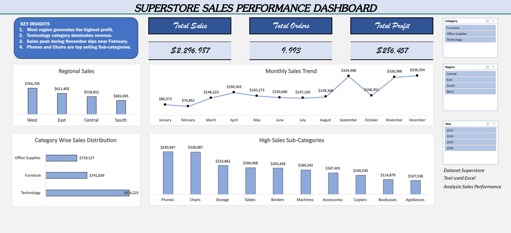
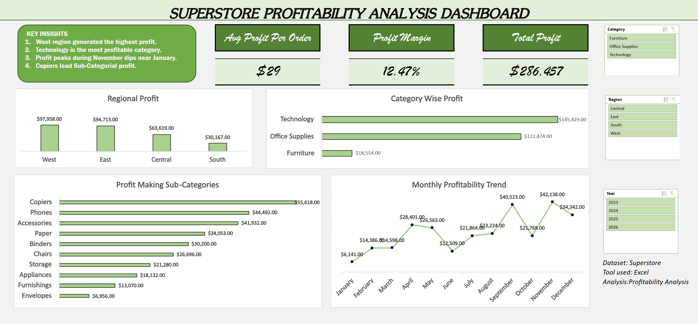

## Excel_Superstore_Sales_Profitability_Dashboard
This project analyzes sales and profitability using Excel.

## Tools used
- Excel
- Pivot Tables
- Data Cleaning
- Dashboards
  
## Sales Dashboard

## Profitability Dashboard 

## Project Files
- Excel dashboard file
- Raw dataset
- Cleaned dataset
- Dashboard screenshots

## Insights
- Sales distribution by region
- Profitability analysis
- Category level performance

## Project Structure
Excel_Superstore_Sales_Profitability_Analysis
| - 
 - ___Data
| - ___Screenshots
| - ___Superstore_Excel_Sales_Profitability_Dashboard.xlsx
| - ___readme.md
